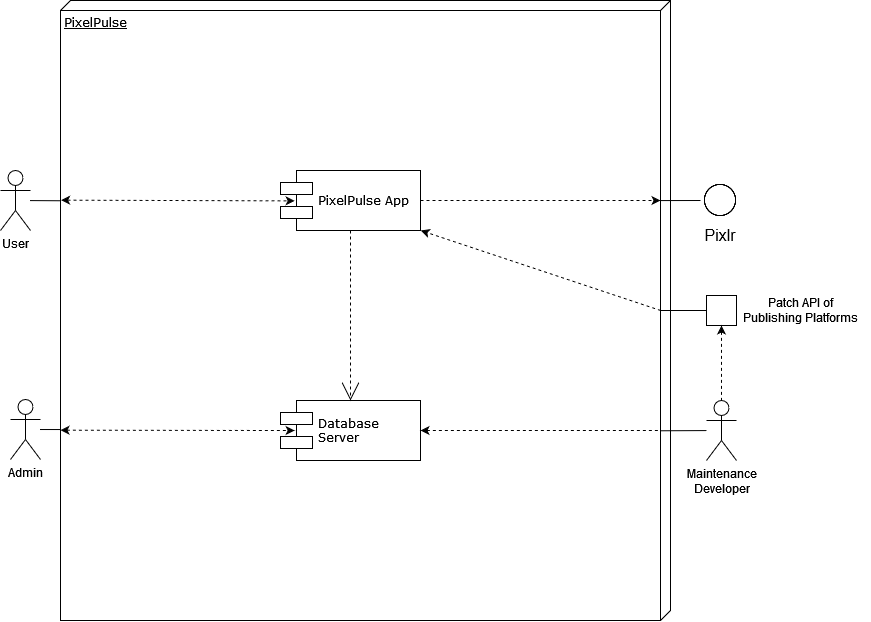
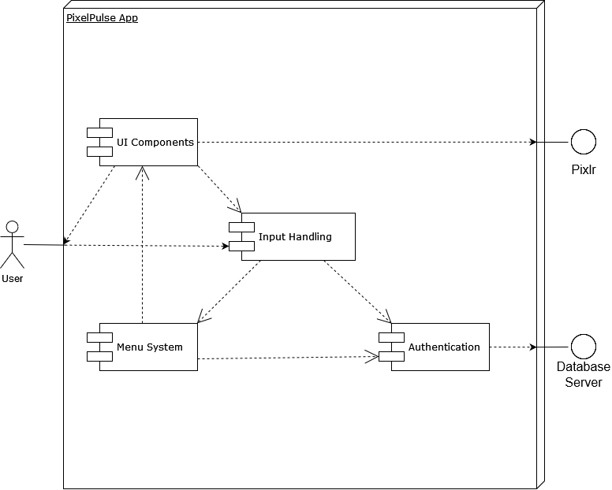
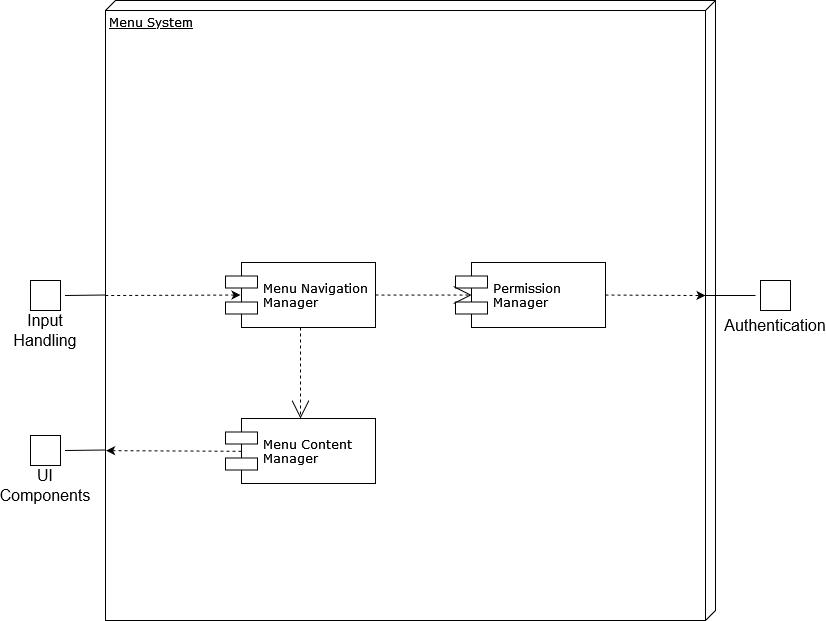
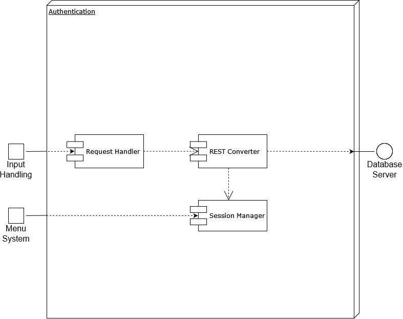
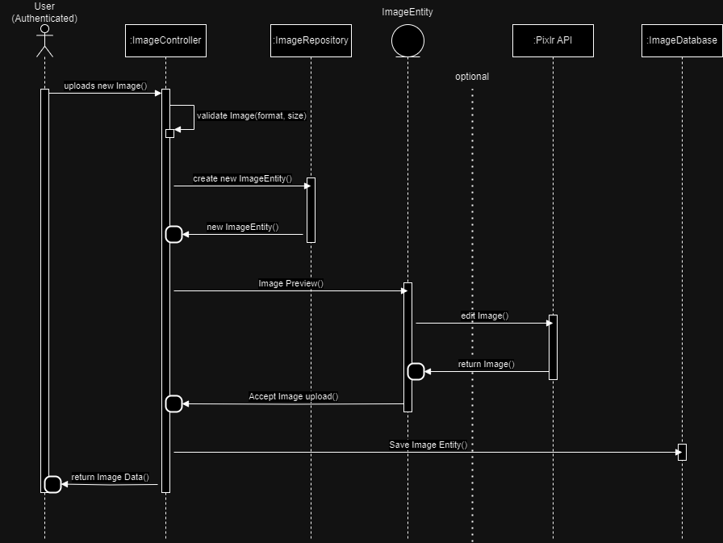
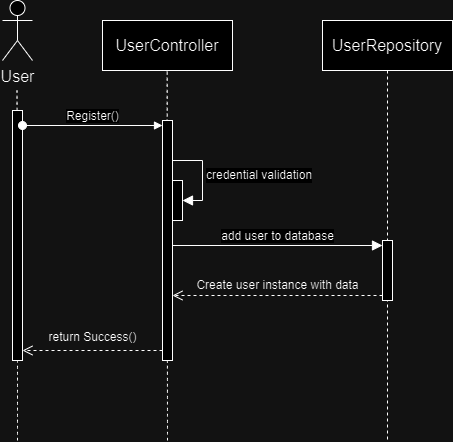
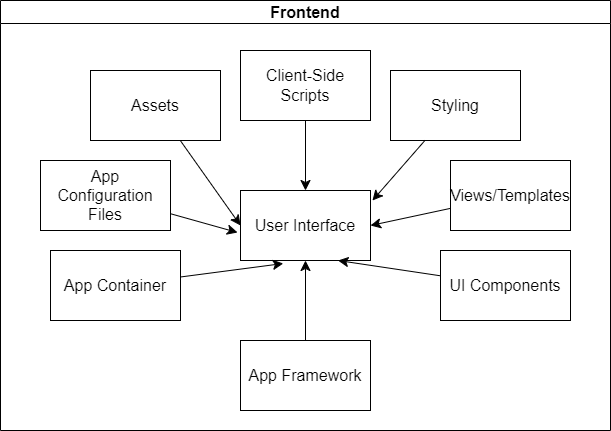
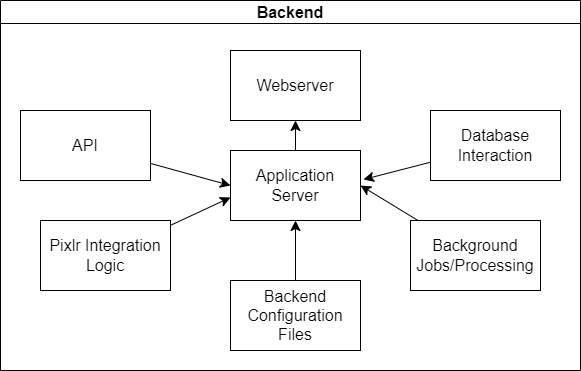

# 

# Introduction and Goals

This document describes the architecture of PixelPulse, an image sharing app that uses
third-party integration to allow users to edit images, as well as the ability to interact
with content other users have posted and creating collections of images/posts.

## Requirements Overview

The following requirements for PixelPulse have been established in the form of
use-case diagrams:

**Use Case 1**  
The user wants to create a new account.  
  

**Use Case 2**  
The user logs in to their account.  
  

**Use Case 3**  
The user uploads and image to the app.  
  

**Use Case 4**  
The user interacts with an image uploaded by another user by commenting and/or liking.  
  

**Use Case 5**  
The user accesses Pixlr's editing tools.  
  

## Quality Goals

|   | **Quality**                   | **Motivation**                                                        |
|---|-------------------------------|-----------------------------------------------------------------------|
| 1 | User Experience + Performance | Ensure the app is user-friendly and provides a seamless experience.   |
| 2 | Security                      | Protect user data and ensure the app is secure from vulnerabilities.  |
| 3 | Availability                  | Minimize downtime and ensure the app is available when users need it. |

## Stakeholders

The following individuals are stakeholders of the system:

-   Sarah Chen,  
    Marketing Manager, Bold Branding Agency
-   Michael Nguyen,  
    Project Manager, Digital Dreams Inc.
-   Ava Patel,  
    Lead Developer, Pixel Perfect Solutions
-   Emily Wong,  
    UX/UI Designer, Creative Co.
-   Samir Singh,  
    User Representative, Photography Enthusiast
-   Lucas Rodriguez,  
    Photography Expert, Snap & Shoot Magazine

| Role                     | Name                 | Contact                      | Expectations       |
|--------------------------|----------------------|------------------------------|--------------------|
| *\<Marketing Manager>*   | *\<Sarah Chen>*      | *\<Bold Branding Agency>*    | *\<Expectation-1>* |
| *\<Project Manager>*     | *\<Michael Nguyen>*  | *\<Digital Dreams Inc.>*     | *\<Expectation-2>* |
| *\<Lead Developer>*      | *\<Ava Patel>*       | *\<Pixel Perfect Solutions>* | *\<Expectation-2>* |
| *\<UX/UI Designer>*      | *\<Emily Wong>*      | *\<Creative Co.>*            | *\<Expectation-2>* |
| *\<User Representative>* | *\<Samir Singh>*     | *\<Photography Enthusiast>*  | *\<Expectation-2>* |
| *\<Photography Expert>*  | *\<Lucas Rodriguez>* | *\<Snap & Shoot Magazine>*   | *\<Expectation-2>* |

<!-- Architecture Constraints -->
# Architecture Constraints

| **Constraints**                                                | **Background and/or Motivation**                                      |
|----------------------------------------------------------------|-----------------------------------------------------------------------|
| Team Constraints (Organizational)                              | Start-Up, small Team                                                  |
| Budget Constraint (Organizational)                             | Start-Up, limited Budget                                              |
| Third-Party Integration Constraint (Technical)                 | Dependent on Pixlr's API stability and availability                   |
| Security and Privacy Constraint (Technical and Organizational) | Legal and regulatory requirements (consequences and damage)           |
| User Adoption Constraint (Organizational)                      | App relies on user adoption (actively address user feedback)          |

<!-- System Scope and Context -->
# System Scope and Context

<!-- Business Context -->
## Business Context

**Business Context**  
  

**System Name: PixelPulse Image Sharing App**  
| Communication Partner          | Inputs                              | Outputs                             |
|--------------------------------|-------------------------------------|-------------------------------------|
| Users                          | User-generated data (photos, text)  | Personalized content, notifications |
| Admins                         | System configurations, user data    | System updates, analytics reports   |
| PixelPulse - Pixlr             | Selected images for editing         | Edited images, processing status    |
| PixelPulse - External Services | Payment details for subscriptions   | Subscription confirmation, receipts |
| PixelPulse - Social Media      | Shared images, user engagement data | Increased brand visibility          |

<!-- Technical Context -->
## Technical Context

**Technical Context**  
  

| Channel                               | Input/Output                        | Channels/Protocols                       |
|---------------------------------------|-------------------------------------|------------------------------------------|
| Users - PixelPulse Server             | User-generated data (photos, text)  | Direct app communication, HTTPS          |
| Admins - PixelPulse Server            | System configurations, user data    | Direct app communication, HTTPS          |
| PixelPulse Server - Pixlr             | Selected images for editing         | Integration via Pixlr API, RESTful APIs  |
| Pixlr - PixelPulse Server             | Edited images, processing status    | Integration via Pixlr API, RESTful APIs  |
| PixelPulse Server - External Services | Payment details for subscriptions   | Secure communication channels, HTTPS     |
| PixelPulse Server - Social Media      | Shared images, user engagement data | APIs (e.g., Facebook API, Instagram API) |

# Solution Strategy

| Quality Goal                 | Scenario                                          | Solution Approach                              |
| ---------------------------- | ------------------------------------------------- | ----------------------------------------------- |
| User Experience and Performance | Ensuring fast image uploads and downloads.        | Optimize image processing and compression.     |
| Security                     | Prevent unauthorized access to user data.         | Implement Two-Factor Authentication (2FA).    |
| Pixlr Integration            | Enabling users to seamlessly edit images.         | Integrate Pixlr's API for image editing.       |
| Relational Database Management | Managing structured data effectively.             | Choose PostgreSQL for relational database management. |
| Cloud Hosting                | Ensuring scalability and reliable hosting.        | Select AWS as the cloud service provider.      |

# Building Block View
## Level 1 - Whitebox Overall System
The building block view shows the static decomposition of the system
into building blocks (modules, components, subsystems, classes,
interfaces, packages, libraries, frameworks, layers, partitions, tiers,
functions, macros, operations, data structures, …) as well as their
dependencies (relationships, associations, …)

**Overview Diagram**

**Motivation**
The PixelPulse system is designed to provide a user-friendly and
efficient way for users to edit and share their images. The system is
composed of a number of interconnected building blocks, each of which
plays a specific role in the overall architecture.

### Contained Building Blocks

| Name                                | Responsibility                                                     |
|-------------------------------------|--------------------------------------------------------------------|
| PixelPulse App                      | Provides the front-end functionality.                              |
| Pixlr                               | Provides image editing tools.                                      |
| Patch API of Publishing Platforms   | Allows the PixelPulse App to receive updates.                      |
| Database Server                     | Authenticates Users and stores data related to images and users.   |
| Admin                               | Personnel for administration system.                               |
| Maintenance Developer               | Personnel for quality assurance and content updates.               |

### Black Box Descriptions

#### PixelPulse App

* Purpose/Responsibility: The PixelPulse App provides the core functionality of the mobile application, including image editing, sharing, and storage.

* Interfaces:
    * Interacts with Pixlr to provide editing tools.
    * Uploads edited images to database server.
    * Retrieves and displays images from the Database.
    * Communicates with the Server to manage user accounts and permissions.

* Quality/Performance Characteristics:
    * Easy to use and navigate.
    * Supports a variety of image editing tools.
    * Efficiently manages data storage and retrieval.
    * Securely protects user data.

* Directory/File Location:
    /PixelPulseApp

* Fulfilled Requirements:
    * R-1: The app should allow users to edit and share images.
    * R-2: The app should be easy to use and navigate.
    * R-3: The app should provide a variety of image editing tools.
    * R-4: The app should seamlessly communicate with the database server.

* Open Issues/Problems/Risks:
    * Potential compatibility issues with different mobile devices.
    * Security vulnerabilities in the data storage and retrieval process.
    * Performance, reliability and availability can be affected because system will only be able to scale vertically due to its monolithic structure.

#### Pixlr

* Purpose/Responsibility: Pixlr provides image editing tools that can be used to edit images before they are uploaded to the database server.

* Interfaces:
    * Receives images from the PixelPulse App.
    * Applies image editing effects to images.
    * Sends edited images back to the PixelPulse App.

* Quality/Performance Characteristics:
    * Powerful image editing capabilities.
    * Supports a wide range of image editing effects.
    * Efficiently processes images.
    * Provides a user-friendly interface.

* Directory/File Location:
    /PixelPulseApp/Pixlr

* Fulfilled Requirements:
    * R-1: The app should provide a variety of image editing tools.
    * R-2: The app should be powerful and efficient.
    * R-3: The app should provide a user-friendly interface.

* Open Issues/Problems/Risks:
    * Potential compatibility issues with different image formats.
    * Performance issues when editing large images.

#### Patch API of Publishing Platforms

* Purpose/Responsibility: The Patch API allows the PixelPulse App to update itself or be updated through the Publishing Platforms it is originally downloaded from. In case of a critical update (e.g. fix for a security breach), users can safely update the app outside of runtime.

* Interfaces:
    * Receives updates from Maintenance Developers.
    * Notifies the App to gatekeep users for the installation of a critical update.

### Important Interfaces

* **PixelPulse App to Pixlr:** This interface allows the PixelPulse App to send images to Pixlr for editing. It is a critical interface because it is responsible for the core functionality of the system.
* **PixelPulse App to Patch API of Publishing Platforms:** This interface allows the PixelPulse App to receive updates from the Patch API. It ensures that the PixelPulse App is always up-to-date with the latest security patches and features.
* **Database Server to PixelPulse App and Pixlr:** This interface allows the Database Server to store and retrieve data related to images and users. It provides a central repository for all user data.
* **Admin to Server:** This interface allows administrators to manage and maintain the system. It ensures that the system is always functioning properly.
* **Maintenance Developer to Patch API of Publishing Platforms:** This interface allows maintenance developers to send updates to the Patch API. It allows the system to be updated without requiring users to manually download new versions of the app.

## Level 2 - White Box PixelPulse App

The PixelPulse App is a user-friendly and efficient mobile application that allows users to edit and share their images. It is composed of a number of interconnected components, each of which plays a specific role in the overall architecture.

**PixelPulse App Diagram**

**Components**

* **UI Components:** The UI is responsible for presenting the app's functionality to users. It includes screens for editing images, sharing images, and managing user accounts. For editing images, it directly loads the Pixlr API and keeps it encapsulated within this block, only its results (edited images) are forwarded.

    *Purpose/Responsibility*
    
    The UI Components manage the presentation layer of the PixelPulse App, ensuring a user-friendly interface for image editing, sharing, and account management.

    *Interfaces*
    
    - Interacts with Pixlr API for image editing.
    - Communicates with Input Handling for user input.
    - Collaborates with other UI components for seamless navigation.

    *Quality/Performance Characteristics*
    
    - Responsive and intuitive user interface.
    - Efficient integration with Pixlr for image editing.
    - Consistent handling of user input.

    *Directory/File Location*
    
    /PixelPulseApp/UIComponents

    *Fulfilled Requirements*
    
    - R-2: The app should be easy to use and navigate.
    - R-4: The app should seamlessly communicate with the database server.

    *Open Issues/Problems/Risks*
    
    - Potential compatibility issues with different mobile devices.
    - Ongoing optimization for better performance.

* **Input Handling:** This component is responsible for receiving user input and directing it to the menu system and/or authentication system in a standardized manner.

    *Purpose/Responsibility*
    
    Input Handling manages the reception and processing of user input, ensuring a smooth interaction with the PixelPulse App.

    *Interfaces*
    
    - Interacts with UI Components for user input.
    - Directs user input to Authentication and Menu System components.

    *Quality/Performance Characteristics*
    
    - Standardized and consistent input processing.
    - Efficient routing of user commands to appropriate components.

    *Directory/File Location*
    
    /PixelPulseApp/InputHandling

    *Fulfilled Requirements*
    
    - R-2: The app should be easy to use and navigate.
    - R-4: The app should seamlessly communicate with the database server.

    *Open Issues/Problems/Risks*
    
    - Continuous improvement for better user experience.

* **Menu System:** The Menu System controls the current location of the user throughout the many menus and prepares the respective menu for further navigation (depending on authentication), other interaction, and hands the data over to UI Components for display.

    *Purpose/Responsibility*
    
    The Menu System manages the navigation and presentation of menus within the PixelPulse App, ensuring a structured and user-friendly experience.

    *Interfaces*
    
    - Collaborates with UI Components for menu display.
    - Communicates with Authentication for user access rights.
    - Receives data from Input Handling for menu preparation.

    *Quality/Performance Characteristics*
    
    - Efficient menu navigation.
    - Responsive menu updates based on user input.

    *Directory/File Location*
    
    /PixelPulseApp/MenuSystem

    *Fulfilled Requirements*
    
    - R-2: The app should be easy to use and navigate.
    - R-4: The app should seamlessly communicate with the database server.

    *Open Issues/Problems/Risks*
    
    - Potential complexity in handling a large number of menu options.

* **Authentication:** Regulates which content a user gets to access and how by authenticating the user's rights through the Database Server. It further also regulates if and what data is transferred to and from the Database Server within the scope of the competencies of the front-end application.

    *Purpose/Responsibility*
    
    Authentication manages user access rights, ensuring secure and authorized interactions with the PixelPulse App.

    *Interfaces*
    
    - Collaborates with Database Server for user authentication.
    - Interacts with Menu System for regulating user access.
    - Communicates with Input Handling for user authentication data.

    *Quality/Performance Characteristics*
    
    - Robust user authentication.
    - Secure data transmission between the app and the database.

    *Directory/File Location*
    
    /PixelPulseApp/Authentication

    *Fulfilled Requirements*
    
    - R-4: The app should seamlessly communicate with the database server.
    - R-5: The app should ensure secure user authentication.

    *Open Issues/Problems/Risks*
    
    - Ongoing monitoring for potential security vulnerabilities.

## Level 3 - White Box Menu System

The Menu System is a critical component of the PixelPulse App responsible for managing the navigation and presentation of menus. It works in conjunction with other components to ensure a seamless user experience.

**Menu System Diagram**

**Components**

* **Menu Navigation Manager:** This component manages the navigation flow within the Menu System, ensuring users are directed to the appropriate menus based on their actions.

    *Purpose/Responsibility*
    
    The Menu Navigation Manager oversees the flow of navigation within the PixelPulse App, directing users to relevant menus based on their interactions.

    *Interfaces*
    
    - Collaborates with Permission Manager for user access rights.
    - Communicates with Menu Content Manager for menu preparation.

    *Quality/Performance Characteristics*
    
    - Seamless and logical menu navigation.
    - Efficient redirection based on user input.

    *Directory/File Location*
    
    /PixelPulseApp/MenuSystem/MenuNavigationManager

    *Fulfilled Requirements*
    
    - R-2: The app should be easy to use and navigate.
    - R-4: The app should seamlessly communicate with the database server.

    *Open Issues/Problems/Risks*
    
    - Continuous improvement for optimizing navigation logic.

* **Permission Manager:** This component interacts with Authentication to manage user access rights within the Menu System, ensuring that users only see menus for which they have the necessary permissions.

    *Purpose/Responsibility*
    
    The Permission Manager regulates user access rights within the Menu System, ensuring a secure and personalized experience.

    *Interfaces*
    
    - Collaborates with Authentication for user access information.

    *Quality/Performance Characteristics*
    
    - Robust enforcement of user access permissions.
    - Secure handling of user access data.

    *Directory/File Location*
    
    /PixelPulseApp/MenuSystem/PermissionManager

    *Fulfilled Requirements*
    
    - R-5: The app should ensure secure user authentication.
    - R-6: The app should enforce user access permissions.

    *Open Issues/Problems/Risks*
    
    - Ongoing monitoring for potential security vulnerabilities.

* **Menu Content Manager:** This component collaborates with UI Components to prepare menus for display, ensuring that the content is dynamically generated based on user interactions.

    *Purpose/Responsibility*
    
    The Menu Content Manager prepares menus for display, dynamically generating content based on user interactions and permissions.

    *Interfaces*
    
    - Communicates with UI Components for menu display.

    *Quality/Performance Characteristics*
    
    - Dynamic and responsive menu content generation.
    - Efficient collaboration with UI Components.

    *Directory/File Location*
    
    /PixelPulseApp/MenuSystem/MenuContentManager

    *Fulfilled Requirements*
    
    - R-2: The app should be easy to use and navigate.
    - R-4: The app should seamlessly communicate with the database server.

    *Open Issues/Problems/Risks*
    
    - Potential complexity in managing a large number of menu options.

## Level 3 - White Box Authentication

Authentication is a critical component responsible for managing user access rights and ensuring secure interactions with the PixelPulse App.

**Authentication Diagram**

**Components**

* **Request Handler:** This component interacts with the REST Converter to handle incoming requests, ensuring proper processing and authentication.

    *Purpose/Responsibility*
    
    The Request Handler manages incoming requests, ensuring proper handling and authentication of user actions.

    *Interfaces*
    
    - Collaborates with REST Converter for request processing.

    *Quality/Performance Characteristics*
    
    - Efficient handling of incoming requests.
    - Secure validation of user actions.

    *Directory/File Location*
    
    /PixelPulseApp/Authentication/RequestHandler

    *Fulfilled Requirements*
    
    - R-4: The app should seamlessly communicate with the database server.
    - R-5: The app should ensure secure user authentication.

    *Open Issues/Problems/Risks*
    
    - Continuous improvement for optimizing request processing.

* **REST Converter:** This component interacts with the Database Server and Session Manager to convert RESTful requests, ensuring proper communication and data transmission.

    *Purpose/Responsibility*
    
    The REST Converter converts RESTful requests, facilitating communication between the app, the database, and session management.

    *Interfaces*
    
    - Collaborates with Database Server and Session Manager for data transmission.

    *Quality/Performance Characteristics*
    
    - Accurate conversion of RESTful requests.
    - Secure handling of data transmission.

    *Directory/File Location*
    
    /PixelPulseApp/Authentication/RESTConverter

    *Fulfilled Requirements*
    
    - R-4: The app should seamlessly communicate with the database server.
    - R-5: The app should ensure secure user authentication.

    *Open Issues/Problems/Risks*
    
    - Ongoing monitoring for potential security vulnerabilities.

* **Session Manager:** This component manages user sessions, ensuring a secure and persistent user experience throughout interactions with the PixelPulse App.

    *Purpose/Responsibility*
    
    The Session Manager oversees user sessions, providing a secure and persistent experience during app interactions.

    *Interfaces*
    
    - Collaborates with Menu System for session management.

    *Quality/Performance Characteristics*
    
    - Secure management of user sessions.
    - Persistent user experience across app interactions.

    *Directory/File Location*
    
    /PixelPulseApp/Authentication/SessionManager

    *Fulfilled Requirements*
    
    - R-5: The app should ensure secure user authentication.
    - R-7: The app should provide a seamless user experience.

    *Open Issues/Problems/Risks*
    
    - Ongoing optimization for better session management.

# Runtime View

## \<Runtime Upload>

## \<Runtime Register>

# Deployment View

## Infrastructure Level 1

| **Node**                       | **Description**                                        |
|--------------------------------|--------------------------------------------------------|
| User Device                    | The device from which the user interacts with the app  |
| Frontend                       | User Interface                                         |
| Authentication + Authorization | Handles client authentication                          |
| Backend                        | Contains app logic                                     |
| Database                       | Contains all data                                      |
| Pixlr API                      | Integration of the Pixlr API                           |
| Image Processing               | Handles Image Processing operations                    |
| Image Storage                  | Contains all user published images                     |
| Monitoring + Logging           | Monitors and logs system status                        |
| Error Handling                 | Centralized Error Handling System                      |
| Notification System            | Handles user notifications                             |
| Search + Discovery             | Users can search for specific users                    |
| Payment Gateway Integration    | Handles transactions                                   |

## Infrastructure Level 2

### *Frontend*

|                           | **Description**                                         |
|---------------------------|---------------------------------------------------------|
| User Interface            | Interface with which the user interacts                 |
| App Framework             | Mobile App development framework                        |
| App Container             | Runtime Environment of the app                          |
| UI Components             | Components responsible for the user interface           |
| Views/Templates           | define the structures of individual screens             |
| Styling                   | Styling logic responsible for the visual appearance     |
| Client-Side Scripts       | Handle client side logic and communication with backend |
| Assets                    | Media assets used in the app's UI                       |
| App Configuration Files   | Config files specific to the app                        |

### *Backend/Server*

|                             | **Description**                                            |
|-----------------------------|------------------------------------------------------------|
| Web Server                  | Deploys backend components                                 |
| Application Server          | Contains backend application logic                         |
| APIs                        | Exposed endpoints for communication with external services |
| Pixlr Integration Logic     | Handles communication with Pixlr API                       |
| Database Interaction        | Database connection                                        |
| Background Jobs/Processing  | Handle background tasks that can be queued                 |
| Backend Configuration Files | Config files specific to the backend                       |

# Cross-cutting Concepts

## *Security*
- **Authentication and Authorization:** User access management is needed in multiple modules, therefore a centralized approach is crucial.
- **Data Protection:** By centralizing the security mechanisms, there is a reduced possibility of security vulenrabilities.

## *Logging and Monitoring*
- **Logging:** Centrally stored logs can be used to identify issues or for auditing purposes.
- **Monitoring:** Monitoring can be used in several places to monitor response times, resource usage and system health and is essential for identifying and addressing performance issues.

## *Error Handling*
- **Centralized Error Handling:** A centralized error handling system helps maintain a standardized approach to dealing with errors.

 

# Architecture Decisions
<!--

**Contents**

Important, expensive, large scale or risky architecture decisions
including rationales. With "decisions" we mean selecting one alternative
based on given criteria.

Please use your judgement to decide whether an architectural decision
should be documented here in this central section or whether you better
document it locally (e.g. within the white box template of one building
block).

Avoid redundancy. Refer to section 4, where you already captured the
most important decisions of your architecture.

**Motivation**

Stakeholders of your system should be able to comprehend and retrace
your decisions.

**Form**

Various options:

-   ADR ([Documenting Architecture
    Decisions](https://cognitect.com/blog/2011/11/15/documenting-architecture-decisions))
    for every important decision

-   List or table, ordered by importance and consequences or:

-   more detailed in form of separate sections per decision

See [Architecture Decisions](https://docs.arc42.org/section-9/) in the
arc42 documentation. There you will find links and examples about ADR.
-->

## ADR 1: User Authentication

**Context:** The system requires a robust and secure user authentication mechanism due to the sensitivity of user data. The application is expected to handle personal information, and compliance with security standards is crucial. 

**Decision:** Selected 2FA as the authentication method.

**Status:** Accepted

**Consequences:** 2FA enhances security but may introduce some complexity in user experience.

## ADR 2: Database Management

**Context:** The system needs a reliable and scalable database management solution to handle structured data effectively. There is a mix of relational and non-relational data requirements, and the choice of a database system will impact performance and scalability.

**Decision:** Chose Relational DB (PostgreSQL) for database management.

**Status:** Accepted

**Consequences:** Relational DB provides structured data storage but may have scalability challenges for certain use cases.

## ADR 3: Choosing a Cloud Service for Hosting and Scalability

**Context:** The system needs a scalable and reliable cloud service provider for hosting its components. Factors include performance, cost, availability, and the ability to integrate with other services.

**Decision:** Selected AWS for hosting and scalability.

**Status:** Accepted

**Consequences:** AWS offers a robust cloud infrastructure but may involve additional costs compared to other cloud providers.

# Quality Requirements

## Quality Tree

- **User Experience and Performance**
  - **Usability:**
    - The application must provide an easy-to-navigate user interface.
      - *Scenario:* Users can upload an image within three clicks or taps.
  - **Performance:**
    - The system must ensure responsive image loading and editing.
      - *Scenario:* Images must load within two seconds, even on slower network connections.
  
- **Security**
  - **Authentication:**
    - The application must securely authenticate users.
      - *Scenario:* Two-Factor Authentication (2FA) is successfully enforced for user login.
  - **Data Protection:**
    - User data must be encrypted during transmission and storage.
      - *Scenario:* Encrypted transmission of user-uploaded images to the server.
  
- **Availability**
  - **Uptime:**
    - The system must have high availability with minimal downtime.
      - *Scenario:* The application should be available 99.9% of the time.
  - **Fault Tolerance:**
    - The system must handle and recover from unexpected failures.
      - *Scenario:* Continued availability during server or service failures.

- **Pixlr Integration**
  - **Reliability:**
    - The integration with Pixlr's API must be reliable.
      - *Scenario:* Users experience minimal delay when accessing Pixlr's editing tools.
  - **Consistency:**
    - Changes made using Pixlr's tools should be consistently applied to user images.
      - *Scenario:* Edits made in Pixlr reflect accurately when saved within PixelPulse.

- **Relational Database Management**
  - **Data Integrity:**
    - The database must ensure data integrity for user information and uploaded images.
      - *Scenario:* No data corruption or loss during high-load periods.
  - **Query Performance:**
    - Database queries must be optimized for efficient retrieval of user data.
      - *Scenario:* Retrieval of images from the database should take less than one second.

- **Cloud Hosting**
  - **Scalability:**
    - Cloud infrastructure must scale dynamically based on demand.
      - *Scenario:* The system can handle a 100% increase in concurrent users during peak times.
  - **Data Redundancy:**
    - Data must be redundantly stored to prevent data loss.
      - *Scenario:* Automatic data recovery in the event of server failure.

## Quality Scenarios

### User Experience and Performance

1. **Usability Scenario:**
   - *Scenario:* A new user should be able upload an image within three clicks or taps.
   - *Expected Outcome:* The image upload feature is easily accessible.

2. **Performance Scenario:**
   - *Scenario:* A user with a slower network connection attempts to view an image.
   - *Expected Outcome:* The image loads within two seconds, providing a responsive user experience.

### Security

3. **Authentication Scenario:**
   - *Scenario:* A user attempts to log in, and Two-Factor Authentication (2FA) is triggered.
   - *Expected Outcome:* The user successfully completes the 2FA process, ensuring secure authentication.

4. **Data Protection Scenario:**
   - *Scenario:* A user uploads a personal image to the system.
   - *Expected Outcome:* The uploaded image is encrypted during transmission and securely stored to protect user data.

### Availability

5. **Uptime Scenario:**
   - *Scenario:* Users attempt to access the application during a 24-hour period.
   - *Expected Outcome:* The application is available 99.9% of the time, meeting high availability standards.

6. **Fault Tolerance Scenario:**
   - *Scenario:* A server hosting user images experiences a temporary failure.
   - *Expected Outcome:* The system continues to function, and automatic recovery mechanisms restore data without impacting users.

### Pixlr Integration

7. **Reliability Scenario:**
   - *Scenario:* Users access Pixlr's editing tools to enhance an image.
   - *Expected Outcome:* Pixlr's tools are responsive with minimal delay, providing a reliable editing experience.

8. **Consistency Scenario:**
    - *Scenario:* A user makes edits in Pixlr and saves them within PixelPulse.
    - *Expected Outcome:* Edits made in Pixlr are consistently reflected in the user's PixelPulse account.

### Relational Database Management

9. **Data Integrity Scenario:**
    - *Scenario:* The system experiences high load during peak usage hours.
    - *Expected Outcome:* The database maintains data integrity without corruption or loss.

10. **Query Performance Scenario:**
    - *Scenario:* A user retrieves a collection of images associated with their account.
    - *Expected Outcome:* The query executes quickly, providing the user with their image collection in less than one second.

### Cloud Hosting

11. **Scalability Scenario:**
    - *Scenario:* Concurrent users increase by 100% during a promotional event.
    - *Expected Outcome:* Cloud infrastructure dynamically scales to accommodate the increased user load.

12. **Data Redundancy Scenario:**
    - *Scenario:* A server hosting user data fails, triggering automatic data recovery.
    - *Expected Outcome:* Redundant data ensures automatic recovery, and users experience no data loss.

# Risks and Technical Debts
<!--

**Contents**

A list of identified technical risks or technical debts, ordered by
priority

**Motivation**

“Risk management is project management for grown-ups” (Tim Lister,
Atlantic Systems Guild.)

This should be your motto for systematic detection and evaluation of
risks and technical debts in the architecture, which will be needed by
management stakeholders (e.g. project managers, product owners) as part
of the overall risk analysis and measurement planning.

**Form**

List of risks and/or technical debts, probably including suggested
measures to minimize, mitigate or avoid risks or reduce technical debts.
-->

1. **User Authentication**
   - **Description:** Integrating user authentication within a monolithic system could pose risks such as data breaches and security vulnerabilities if not appropriately designed and maintained. This may result in heightened technical debt, necessitating continuous security updates and monitoring.
   - **Mitigation Measures:** Conducting regular security audits, implementing best practices for authentication, and continuously monitoring security vulnerabilities are crucial measures to mitigate the associated risks in a monolithic architecture.

2. **Scalability Challenges**
   - **Description:** Developing a monolithic architecture while prioritizing user experience can introduce scalability challenges.
   - **Mitigation Measures:** Continuous performance testing, adopting scalable design patterns within the monolith, implementing dynamic scaling solutions.

3. **Data Consistency**
   - **Description:** Ensuring data consistency and synchronization within a monolithic architecture can pose a significant technical debt.
   - **Mitigation Measures:** Implementing eventual consistency models, utilizing distributed transaction management, and enforcing robust data synchronization mechanisms can help address challenges associated with data consistency in a monolithic system.

