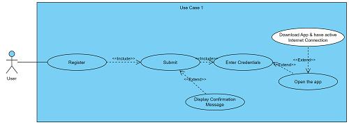
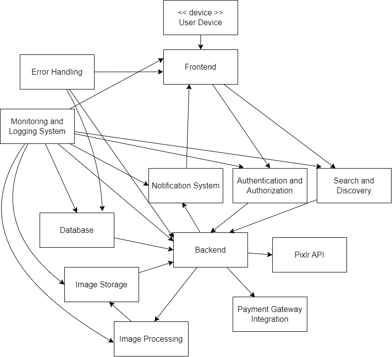

# 

# Introduction and Goals

<!---
Describes the relevant requirements and the driving forces that software
architects and development team must consider. These include

-   underlying business goals,

-   essential features,

-   essential functional requirements,

-   quality goals for the architecture and

-   relevant stakeholders and their expectations
--->

This document describes the architecture of PixelPulse, an image sharing app that uses
third-party integration to allow users to edit images, as well as the ability to interact
with content other users have posted and creating collections of images/posts.

## Requirements Overview

<!--

**Contents**

Short description of the functional requirements, driving forces,
extract (or abstract) of requirements. Link to (hopefully existing)
requirements documents (with version number and information where to
find it).

**Motivation**

From the point of view of the end users a system is created or modified
to improve support of a business activity and/or improve the quality.

**Form**

Short textual description, probably in tabular use-case format. If
requirements documents exist this overview should refer to these
documents.

Keep these excerpts as short as possible. Balance readability of this
document with potential redundancy w.r.t to requirements documents.

See [Introduction and Goals](https://docs.arc42.org/section-1/) in the
arc42 documentation.
-->

The following requirements for PixelPulse have been established in the form of
use-case diagrams:

**Use Case 1**

The user wants to create a new account.

**Use Case 2**

The user logs in to their account.

**Use Case 3**

The user uploads and image to the app.

**Use Case 4**

The user interacts with an image uploaded by another user by commenting and/or liking.

**Use Case 5**

The user accesses Pixlr's editing tools.

## Quality Goals

<!--

**Contents**

The top three (max five) quality goals for the architecture whose
fulfillment is of highest importance to the major stakeholders. We
really mean quality goals for the architecture. Don’t confuse them with
project goals. They are not necessarily identical.

Consider this overview of potential topics (based upon the ISO 25010
standard):

**Motivation**

You should know the quality goals of your most important stakeholders,
since they will influence fundamental architectural decisions. Make sure
to be very concrete about these qualities, avoid buzzwords. If you as an
architect do not know how the quality of your work will be judged…

**Form**

A table with quality goals and concrete scenarios, ordered by priorities
-->

|   | **Quality**                   | **Motivation**                                                        |
|---|-------------------------------|-----------------------------------------------------------------------|
| 1 | User Experience + Performance | Ensure the app is user-friendly and provides a seamless experience.   |
| 2 | Security                      | Protect user data and ensure the app is secure from vulnerabilities.  |
| 3 | Availability                  | Minimize downtime and ensure the app is available when users need it. |

## Stakeholders

**Contents**

The following individuals are stakeholders of the system:

-   Sarah Chen,  
    Marketing Manager, Bold Branding Agency
-   Michael Nguyen,  
    Project Manager, Digital Dreams Inc.
-   Ava Patel,  
    Lead Developer, Pixel Perfect Solutions
-   Emily Wong,  
    UX/UI Designer, Creative Co.
-   Samir Singh,  
    User Representative, Photography Enthusiast
-   Lucas Rodriguez,  
    Photography Expert, Snap & Shoot Magazine

**Motivation**

**Form**

| Role                     | Name                 | Contact                      | Expectations       |
|--------------------------|----------------------|------------------------------|--------------------|
| *\<Marketing Manager>*   | *\<Sarah Chen>*      | *\<Bold Branding Agency>*    | *\<Expectation-1>* |
| *\<Project Manager>*     | *\<Michael Nguyen>*  | *\<Digital Dreams Inc.>*     | *\<Expectation-2>* |
| *\<Lead Developer>*      | *\<Ava Patel>*       | *\<Pixel Perfect Solutions>* | *\<Expectation-2>* |
| *\<UX/UI Designer>*      | *\<Emily Wong>*      | *\<Creative Co.>*            | *\<Expectation-2>* |
| *\<User Representative>* | *\<Samir Singh>*     | *\<Photography Enthusiast>*  | *\<Expectation-2>* |
| *\<Photography Expert>*  | *\<Lucas Rodriguez>* | *\<Snap & Shoot Magazine>*   | *\<Expectation-2>* |

# Architecture Constraints

**Contents**

Any requirement that constraints software architects in their freedom of
design and implementation decisions or decision about the development
process. These constraints sometimes go beyond individual systems and
are valid for whole organizations and companies.

| **Constraints**                                                | **Background and/or Motivation**                                      |
|----------------------------------------------------------------|-----------------------------------------------------------------------|
| Team Constraints (Organizational)                              | Start-Up, small Team                                                  |
| Budget Constraint (Organizational)                             | Start-Up, limited Budget                                              |
| Third-Party Integration Constraint (Technical)                 | Dependent on Pixlr's API stability and availability                   |
| Security and Privacy Constraint (Technical and Organizational) | Legal and regulatory requirements (consequences and damage)           |
| User Adoption Constraint (Organizational)                      | App relies on user adoption (actively address user feedback)          |

**Motivation**

Architects should know exactly where they are free in their design
decisions and where they must adhere to constraints. Constraints must
always be dealt with; they may be negotiable, though.

**Form**

Simple tables of constraints with explanations. If needed you can
subdivide them into technical constraints, organizational and political
constraints and conventions (e.g. programming or versioning guidelines,
documentation or naming conventions)

See [Architecture Constraints](https://docs.arc42.org/section-2/) in the
arc42 documentation.

<!-- System Scope and Context -->
# System Scope and Context

<!-- Business Context -->
## Business Context

**Contents**

Specification of **all** communication partners (users, IT-systems, …)
with explanations of domain specific inputs and outputs or interfaces.
Optionally you can add domain specific formats or communication
protocols.

**Motivation**

All stakeholders should understand which data are exchanged with the
environment of the system.

**Form**

**Business Context**  
  

**System Name: PixelPulse Image Sharing App**  
| Communication Partner          | Inputs                              | Outputs                             |
|--------------------------------|-------------------------------------|-------------------------------------|
| Users                          | User-generated data (photos, text)  | Personalized content, notifications |
| Admins                         | System configurations, user data    | System updates, analytics reports   |
| PixelPulse - Pixlr             | Selected images for editing         | Edited images, processing status    |
| PixelPulse - External Services | Payment details for subscriptions   | Subscription confirmation, receipts |
| PixelPulse - Social Media      | Shared images, user engagement data | Increased brand visibility          |

<!--
All kinds of diagrams that show the system as a black box and specify
the domain interfaces to communication partners.

Alternatively (or additionally) you can use a table. The title of the
table is the name of your system, the three columns contain the name of
the communication partner, the inputs, and the outputs.

**\<Diagram or Table>**

**\<optionally: Explanation of external domain interfaces>**
-->

<!-- Technical Context -->
## Technical Context

**Contents**

Technical interfaces (channels and transmission media) linking your
system to its environment. In addition a mapping of domain specific
input/output to the channels, i.e. an explanation which I/O uses which
channel.

**Motivation**

Many stakeholders make architectural decision based on the technical
interfaces between the system and its context. Especially infrastructure
or hardware designers decide these technical interfaces.

**Form**  

**Technical Context**  
  

| Channel                               | Input/Output                        | Channels/Protocols                       |
|---------------------------------------|-------------------------------------|------------------------------------------|
| Users - PixelPulse Server             | User-generated data (photos, text)  | Direct app communication, HTTPS          |
| Admins - PixelPulse Server            | System configurations, user data    | Direct app communication, HTTPS          |
| PixelPulse Server - Pixlr             | Selected images for editing         | Integration via Pixlr API, RESTful APIs  |
| Pixlr - PixelPulse Server             | Edited images, processing status    | Integration via Pixlr API, RESTful APIs  |
| PixelPulse Server - External Services | Payment details for subscriptions   | Secure communication channels, HTTPS     |
| PixelPulse Server - Social Media      | Shared images, user engagement data | APIs (e.g., Facebook API, Instagram API) |

<!--
E.g. UML deployment diagram describing channels to neighboring systems,
together with a mapping table showing the relationships between channels
and input/output.

**\<Diagram or Table>**

**\<optionally: Explanation of technical interfaces>**

**\<Mapping Input/Output to Channels>**
-->

# Solution Strategy

| Quality Goal                 | Scenario                                          | Solution Approach                              |
| ---------------------------- | ------------------------------------------------- | ----------------------------------------------- |
| User Experience and Performance | Ensuring fast image uploads and downloads.        | Optimize image processing and compression.     |
| Security                     | Prevent unauthorized access to user data.         | Implement Two-Factor Authentication (2FA).    |
| Pixlr Integration            | Enabling users to seamlessly edit images.         | Integrate Pixlr's API for image editing.       |
| Relational Database Management | Managing structured data effectively.             | Choose PostgreSQL for relational database management. |
| Cloud Hosting                | Ensuring scalability and reliable hosting.        | Select AWS as the cloud service provider.      |

# Building Block View

**Content**

The building block view shows the static decomposition of the system
into building blocks (modules, components, subsystems, classes,
interfaces, packages, libraries, frameworks, layers, partitions, tiers,
functions, macros, operations, data structures, …) as well as their
dependencies (relationships, associations, …)

This view is mandatory for every architecture documentation. In analogy
to a house this is the *floor plan*.

**Motivation**

Maintain an overview of your source code by making its structure
understandable through abstraction.

This allows you to communicate with your stakeholder on an abstract
level without disclosing implementation details.

**Form**

The building block view is a hierarchical collection of black boxes and
white boxes (see figure below) and their descriptions.

**Level 1** is the white box description of the overall system together
with black box descriptions of all contained building blocks.

**Level 2** zooms into some building blocks of level 1. Thus it contains
the white box description of selected building blocks of level 1,
together with black box descriptions of their internal building blocks.

**Level 3** zooms into selected building blocks of level 2, and so on.

See [Building Block View](https://docs.arc42.org/section-5/) in the
arc42 documentation.

## Whitebox Overall System

Here you describe the decomposition of the overall system using the
following white box template. It contains

-   an overview diagram

-   a motivation for the decomposition

-   black box descriptions of the contained building blocks. For these
    we offer you alternatives:

    -   use *one* table for a short and pragmatic overview of all
        contained building blocks and their interfaces

    -   use a list of black box descriptions of the building blocks
        according to the black box template (see below). Depending on
        your choice of tool this list could be sub-chapters (in text
        files), sub-pages (in a Wiki) or nested elements (in a modeling
        tool).

-   (optional:) important interfaces, that are not explained in the
    black box templates of a building block, but are very important for
    understanding the white box. Since there are so many ways to specify
    interfaces why do not provide a specific template for them. In the
    worst case you have to specify and describe syntax, semantics,
    protocols, error handling, restrictions, versions, qualities,
    necessary compatibilities and many things more. In the best case you
    will get away with examples or simple signatures.

***\<Overview Diagram>***

Motivation  
*\<text explanation>*

Contained Building Blocks  
*\<Description of contained building block (black boxes)>*

Important Interfaces  
*\<Description of important interfaces>*

Insert your explanations of black boxes from level 1:

If you use tabular form you will only describe your black boxes with
name and responsibility according to the following schema:

| **Name**         | **Responsibility** |
|------------------|--------------------|
| *\<black box 1>* |  *\<Text>*         |
| *\<black box 2>* |  *\<Text>*         |

If you use a list of black box descriptions then you fill in a separate
black box template for every important building block . Its headline is
the name of the black box.

### \<Name black box 1>

Here you describe \<black box 1> according the the following black box
template:

-   Purpose/Responsibility

-   Interface(s), when they are not extracted as separate paragraphs.
    This interfaces may include qualities and performance
    characteristics.

-   (Optional) Quality-/Performance characteristics of the black box,
    e.g.availability, run time behavior, ….

-   (Optional) directory/file location

-   (Optional) Fulfilled requirements (if you need traceability to
    requirements).

-   (Optional) Open issues/problems/risks

*\<Purpose/Responsibility>*

*\<Interface(s)>*

*\<(Optional) Quality/Performance Characteristics>*

*\<(Optional) Directory/File Location>*

*\<(Optional) Fulfilled Requirements>*

*\<(optional) Open Issues/Problems/Risks>*

### \<Name black box 2>

*\<black box template>*

### \<Name black box n>

*\<black box template>*

### \<Name interface 1>

…

### \<Name interface m>

## Level 2

Here you can specify the inner structure of (some) building blocks from
level 1 as white boxes.

You have to decide which building blocks of your system are important
enough to justify such a detailed description. Please prefer relevance
over completeness. Specify important, surprising, risky, complex or
volatile building blocks. Leave out normal, simple, boring or
standardized parts of your system

### White Box *\<building block 1>*

…describes the internal structure of *building block 1*.

*\<white box template>*

### White Box *\<building block 2>*

*\<white box template>*

…

### White Box *\<building block m>*

*\<white box template>*

## Level 3

Here you can specify the inner structure of (some) building blocks from
level 2 as white boxes.

When you need more detailed levels of your architecture please copy this
part of arc42 for additional levels.

### White Box \<\_building block x.1\_\>

Specifies the internal structure of *building block x.1*.

*\<white box template>*

### White Box \<\_building block x.2\_\>

*\<white box template>*

### White Box \<\_building block y.1\_\>

*\<white box template>*

# Runtime View

**Contents**

The runtime view describes concrete behavior and interactions of the
system’s building blocks in form of scenarios from the following areas:

-   important use cases or features: how do building blocks execute
    them?

-   interactions at critical external interfaces: how do building blocks
    cooperate with users and neighboring systems?

-   operation and administration: launch, start-up, stop

-   error and exception scenarios

Remark: The main criterion for the choice of possible scenarios
(sequences, workflows) is their **architectural relevance**. It is
**not** important to describe a large number of scenarios. You should
rather document a representative selection.

**Motivation**

You should understand how (instances of) building blocks of your system
perform their job and communicate at runtime. You will mainly capture
scenarios in your documentation to communicate your architecture to
stakeholders that are less willing or able to read and understand the
static models (building block view, deployment view).

**Form**

There are many notations for describing scenarios, e.g.

-   numbered list of steps (in natural language)

-   activity diagrams or flow charts

-   sequence diagrams

-   BPMN or EPCs (event process chains)

-   state machines

-   …

See [Runtime View](https://docs.arc42.org/section-6/) in the arc42
documentation.

## \<Runtime Scenario 1>

-   *\<insert runtime diagram or textual description of the scenario>*

-   *\<insert description of the notable aspects of the interactions
    between the building block instances depicted in this diagram.>*

## \<Runtime Scenario 2>

## …

## \<Runtime Scenario n>

# Deployment View

<!--

**Content**

The deployment view describes:

1.  technical infrastructure used to execute your system, with
    infrastructure elements like geographical locations, environments,
    computers, processors, channels and net topologies as well as other
    infrastructure elements and

2.  mapping of (software) building blocks to that infrastructure
    elements.

Often systems are executed in different environments, e.g. development
environment, test environment, production environment. In such cases you
should document all relevant environments.

Especially document a deployment view if your software is executed as
distributed system with more than one computer, processor, server or
container or when you design and construct your own hardware processors
and chips.

From a software perspective it is sufficient to capture only those
elements of an infrastructure that are needed to show a deployment of
your building blocks. Hardware architects can go beyond that and
describe an infrastructure to any level of detail they need to capture.

**Motivation**

Software does not run without hardware. This underlying infrastructure
can and will influence a system and/or some cross-cutting concepts.
Therefore, there is a need to know the infrastructure.

Maybe a highest level deployment diagram is already contained in section
3.2. as technical context with your own infrastructure as ONE black box.
In this section one can zoom into this black box using additional
deployment diagrams:

-   UML offers deployment diagrams to express that view. Use it,
    probably with nested diagrams, when your infrastructure is more
    complex.

-   When your (hardware) stakeholders prefer other kinds of diagrams
    rather than a deployment diagram, let them use any kind that is able
    to show nodes and channels of the infrastructure.

See [Deployment View](https://docs.arc42.org/section-7/) in the arc42
documentation.-->

## Infrastructure Level 1

| **Node**               | **Description**                                        |
|------------------------|--------------------------------------------------------|
| Client Device          | The device from which the user interacts with the app  |
| Load Balancer          | Distributes incoming traffic across multiple instances |
| Frontend Server        | Handles client requests                                |
| Database               | Stores data                                            |
| External Services      | Connection to third-party services                     |

<!-- Describe (usually in a combination of diagrams, tables, and text):

-   distribution of a system to multiple locations, environments,
    computers, processors, .., as well as physical connections between
    them

-   important justifications or motivations for this deployment
    structure

-   quality and/or performance features of this infrastructure

-   mapping of software artifacts to elements of this infrastructure

For multiple environments or alternative deployments please copy and
adapt this section of arc42 for all relevant environments.

***\<Overview Diagram>***

Motivation  
*\<explanation in text form>*

Quality and/or Performance Features  
*\<explanation in text form>*

Mapping of Building Blocks to Infrastructure  
*\<description of the mapping>* -->

## Infrastructure Level 2

<!--Here you can include the internal structure of (some) infrastructure
elements from level 1.

Please copy the structure from level 1 for each selected element.-->

### *Frontend Server*

|                           | **Description**                                        |
|---------------------------|--------------------------------------------------------|
| Authentication Service    | Microservice that handles user authentication          |
| Image Upload Service      | Microservice that handles user uploaded images         |
| Pixlr Integration Service | Microservice that connects to the Pixlr API            |
| Image Processing Service  | Microservice that processes images for storage         |
| Notification Service      | Microservice that handles user notifications           |
| Database Service          | Microservice that handles the database connection      |
| Search Service            | Microservice that handles search requests              |

### *Database*

|                                   | **Description**                                                       |
|-----------------------------------|-----------------------------------------------------------------------|
| Database Management Service       | Microservice that handles management and coordination of the database |
| Data Storage Service              | Microservice that stores and retrieves the actual data                |
| Caching Service                   | Microservice that implements caching to improve data access speeds    |
| Transaction Service               | Microservice that ensures data consistency and integrity              |
| Security + Access Control Service | Microservice that enforces security measures                          |
| Data Encryption Service           | Microservice that implements ecnryption mechanisms on sensitive data  |

### *External Services*

|                               | **Description**                                                                                           |
|-------------------------------|-----------------------------------------------------------------------------------------------------------|
| Pixlr Integration             | Third-party Pixlr integration                                                                             |
| Email Service                 | Microservice that sends account-related notifications via third-party integration                         |
| SMS Service                   | Microservice that handles 2FA and account verification via third-party integration                        |
| Analytics + Tracking Service  | Microservice that handles user analytics tracking via third-party integration                             |
| Push Notification Service     | Microservice that sends real-time notifications to user devices via third-party integration               |
| Social Media Service          | Microservice that allows for cross-plattform sharing and registration via external social media platforms |
| File Storage + Backup Service | Microservice that handles user data backups via third-party integration                                   |
| Compliance + Security Service | Microservice that implements compliance checks and vulnerability assessments via third-party integration  |

# Cross-cutting Concepts

<!--
**Content**

This section describes overall, principal regulations and solution ideas
that are relevant in multiple parts (= cross-cutting) of your system.
Such concepts are often related to multiple building blocks. They can
include many different topics, such as

-   models, especially domain models

-   architecture or design patterns

-   rules for using specific technology

-   principal, often technical decisions of an overarching (=
    cross-cutting) nature

-   implementation rules

**Motivation**

Concepts form the basis for *conceptual integrity* (consistency,
homogeneity) of the architecture. Thus, they are an important
contribution to achieve inner qualities of your system.

Some of these concepts cannot be assigned to individual building blocks,
e.g. security or safety.

**Form**

The form can be varied:

-   concept papers with any kind of structure

-   cross-cutting model excerpts or scenarios using notations of the
    architecture views

-   sample implementations, especially for technical concepts

-   reference to typical usage of standard frameworks (e.g. using
    Hibernate for object/relational mapping)

**Structure**

A potential (but not mandatory) structure for this section could be:

-   Domain concepts

-   User Experience concepts (UX)

-   Safety and security concepts

-   Architecture and design patterns

-   "Under-the-hood"

-   development concepts

-   operational concepts

Note: it might be difficult to assign individual concepts to one
specific topic on this list.

See [Concepts](https://docs.arc42.org/section-8/) in the arc42
documentation. -->

## *Security*
- **Authentication and Authorization:** User access management is needed in multiple modules, therefore a centralized approach is crucial.
- **Data Protection:** By centralizing the security mechanisms, there is a reduced possibility of security vulenrabilities.

## *Logging and Monitoring*
- **Logging:** Centrally stored logs can be used to identify issues or for auditing purposes.
- **Monitoring:** Monitoring can be used in several places to monitor response times, resource usage and system health and is essential for identifying and addressing performance issues.

## *Error Handling*
- **Centralized Error Handling:** A centralized error handling system helps maintain a standardized approach to dealing with errors.

## *Caching*
- **Information Caching:** Storing frequently accessed information in a cache can improve performance.

# Architecture Decisions
<!--

**Contents**

Important, expensive, large scale or risky architecture decisions
including rationales. With "decisions" we mean selecting one alternative
based on given criteria.

Please use your judgement to decide whether an architectural decision
should be documented here in this central section or whether you better
document it locally (e.g. within the white box template of one building
block).

Avoid redundancy. Refer to section 4, where you already captured the
most important decisions of your architecture.

**Motivation**

Stakeholders of your system should be able to comprehend and retrace
your decisions.

**Form**

Various options:

-   ADR ([Documenting Architecture
    Decisions](https://cognitect.com/blog/2011/11/15/documenting-architecture-decisions))
    for every important decision

-   List or table, ordered by importance and consequences or:

-   more detailed in form of separate sections per decision

See [Architecture Decisions](https://docs.arc42.org/section-9/) in the
arc42 documentation. There you will find links and examples about ADR.
-->

## ADR 1: User Authentication

**Context:** The system requires a robust and secure user authentication mechanism due to the sensitivity of user data. The application is expected to handle personal information, and compliance with security standards is crucial. 

**Decision:** Selected 2FA as the authentication method.

**Status:** Accepted

**Consequences:** 2FA enhances security but may introduce some complexity in user experience.

## ADR 2: Database Management

**Context:** The system needs a reliable and scalable database management solution to handle structured data effectively. There is a mix of relational and non-relational data requirements, and the choice of a database system will impact performance and scalability.

**Decision:** Chose Relational DB (PostgreSQL) for database management.

**Status:** Accepted

**Consequences:** Relational DB provides structured data storage but may have scalability challenges for certain use cases.

## ADR 3: Choosing a Cloud Service for Hosting and Scalability

**Context:** The system needs a scalable and reliable cloud service provider for hosting its components. Factors include performance, cost, availability, and the ability to integrate with other services.

**Decision:** Selected AWS for hosting and scalability.

**Status:** Accepted

**Consequences:** AWS offers a robust cloud infrastructure but may involve additional costs compared to other cloud providers.

# Quality Requirements

## Quality Tree

- **User Experience and Performance**
  - **Usability:**
    - The application must provide an easy-to-navigate user interface.
      - *Scenario:* Users can upload an image within three clicks or taps.
  - **Performance:**
    - The system must ensure responsive image loading and editing.
      - *Scenario:* Images must load within two seconds, even on slower network connections.
  
- **Security**
  - **Authentication:**
    - The application must securely authenticate users.
      - *Scenario:* Two-Factor Authentication (2FA) is successfully enforced for user login.
  - **Data Protection:**
    - User data must be encrypted during transmission and storage.
      - *Scenario:* Encrypted transmission of user-uploaded images to the server.
  
- **Availability**
  - **Uptime:**
    - The system must have high availability with minimal downtime.
      - *Scenario:* The application should be available 99.9% of the time.
  - **Fault Tolerance:**
    - The system must handle and recover from unexpected failures.
      - *Scenario:* Continued availability during server or service failures.

- **Pixlr Integration**
  - **Reliability:**
    - The integration with Pixlr's API must be reliable.
      - *Scenario:* Users experience minimal delay when accessing Pixlr's editing tools.
  - **Consistency:**
    - Changes made using Pixlr's tools should be consistently applied to user images.
      - *Scenario:* Edits made in Pixlr reflect accurately when saved within PixelPulse.

- **Relational Database Management**
  - **Data Integrity:**
    - The database must ensure data integrity for user information and uploaded images.
      - *Scenario:* No data corruption or loss during high-load periods.
  - **Query Performance:**
    - Database queries must be optimized for efficient retrieval of user data.
      - *Scenario:* Retrieval of images from the database should take less than one second.

- **Cloud Hosting**
  - **Scalability:**
    - Cloud infrastructure must scale dynamically based on demand.
      - *Scenario:* The system can handle a 100% increase in concurrent users during peak times.
  - **Data Redundancy:**
    - Data must be redundantly stored to prevent data loss.
      - *Scenario:* Automatic data recovery in the event of server failure.

## Quality Scenarios

### User Experience and Performance

1. **Usability Scenario:**
   - *Scenario:* A new user should be able upload an image within three clicks or taps.
   - *Expected Outcome:* The image upload feature is easily accessible.

2. **Performance Scenario:**
   - *Scenario:* A user with a slower network connection attempts to view an image.
   - *Expected Outcome:* The image loads within two seconds, providing a responsive user experience.

### Security

3. **Authentication Scenario:**
   - *Scenario:* A user attempts to log in, and Two-Factor Authentication (2FA) is triggered.
   - *Expected Outcome:* The user successfully completes the 2FA process, ensuring secure authentication.

4. **Data Protection Scenario:**
   - *Scenario:* A user uploads a personal image to the system.
   - *Expected Outcome:* The uploaded image is encrypted during transmission and securely stored to protect user data.

### Availability

5. **Uptime Scenario:**
   - *Scenario:* Users attempt to access the application during a 24-hour period.
   - *Expected Outcome:* The application is available 99.9% of the time, meeting high availability standards.

6. **Fault Tolerance Scenario:**
   - *Scenario:* A server hosting user images experiences a temporary failure.
   - *Expected Outcome:* The system continues to function, and automatic recovery mechanisms restore data without impacting users.

### Pixlr Integration

7. **Reliability Scenario:**
   - *Scenario:* Users access Pixlr's editing tools to enhance an image.
   - *Expected Outcome:* Pixlr's tools are responsive with minimal delay, providing a reliable editing experience.

8. **Consistency Scenario:**
    - *Scenario:* A user makes edits in Pixlr and saves them within PixelPulse.
    - *Expected Outcome:* Edits made in Pixlr are consistently reflected in the user's PixelPulse account.

### Relational Database Management

9. **Data Integrity Scenario:**
    - *Scenario:* The system experiences high load during peak usage hours.
    - *Expected Outcome:* The database maintains data integrity without corruption or loss.

10. **Query Performance Scenario:**
    - *Scenario:* A user retrieves a collection of images associated with their account.
    - *Expected Outcome:* The query executes quickly, providing the user with their image collection in less than one second.

### Cloud Hosting

11. **Scalability Scenario:**
    - *Scenario:* Concurrent users increase by 100% during a promotional event.
    - *Expected Outcome:* Cloud infrastructure dynamically scales to accommodate the increased user load.

12. **Data Redundancy Scenario:**
    - *Scenario:* A server hosting user data fails, triggering automatic data recovery.
    - *Expected Outcome:* Redundant data ensures automatic recovery, and users experience no data loss.

# Risks and Technical Debts
<!--

**Contents**

A list of identified technical risks or technical debts, ordered by
priority

**Motivation**

“Risk management is project management for grown-ups” (Tim Lister,
Atlantic Systems Guild.)

This should be your motto for systematic detection and evaluation of
risks and technical debts in the architecture, which will be needed by
management stakeholders (e.g. project managers, product owners) as part
of the overall risk analysis and measurement planning.

**Form**

List of risks and/or technical debts, probably including suggested
measures to minimize, mitigate or avoid risks or reduce technical debts.
-->

1. **User Authentication**
   - **Description:** Integrating user authentication within a monolithic system could pose risks such as data breaches and security vulnerabilities if not appropriately designed and maintained. This may result in heightened technical debt, necessitating continuous security updates and monitoring.
   - **Mitigation Measures:** Conducting regular security audits, implementing best practices for authentication, and continuously monitoring security vulnerabilities are crucial measures to mitigate the associated risks in a monolithic architecture.

2. **Scalability Challenges**
   - **Description:** Developing a monolithic architecture while prioritizing user experience can introduce scalability challenges.
   - **Mitigation Measures:** Continuous performance testing, adopting scalable design patterns within the monolith, implementing dynamic scaling solutions.

3. **Data Consistency**
   - **Description:** Ensuring data consistency and synchronization within a monolithic architecture can pose a significant technical debt.
   - **Mitigation Measures:** Implementing eventual consistency models, utilizing distributed transaction management, and enforcing robust data synchronization mechanisms can help address challenges associated with data consistency in a monolithic system.

